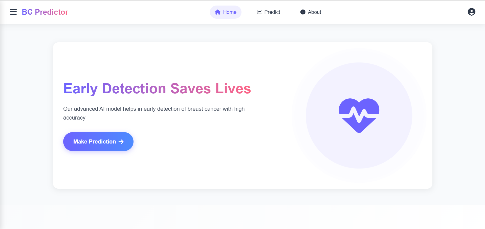
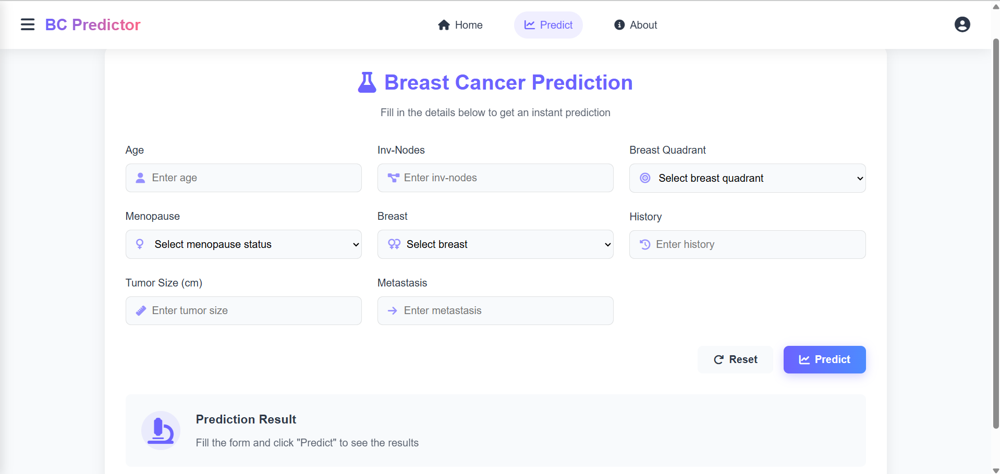
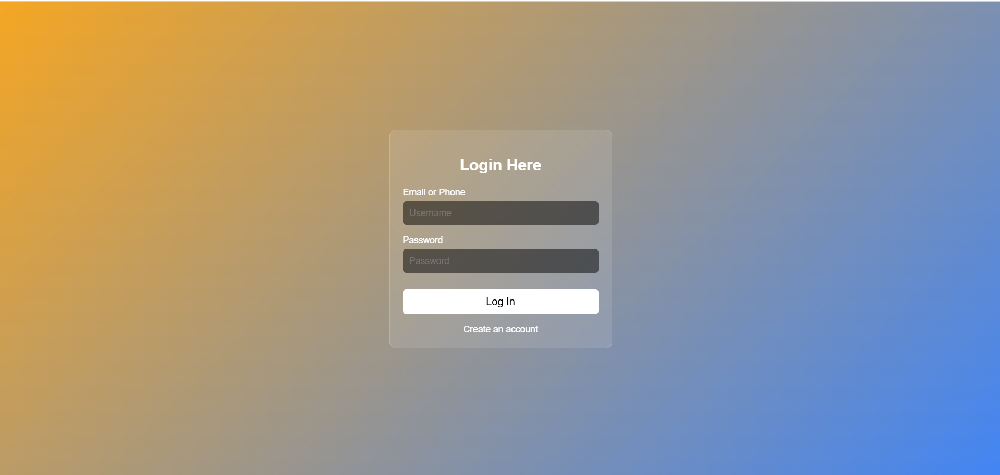

# Breast_Cancer_Prediction
About A web application built using Django and a Machine Learning model (Logistic Regression) that predicts whether a tumor is malignant or benign based on user-inputted medical data. The model was trained on a standard dataset, and the app provides real-time predictions with a user-friendly interface.

## 🚀 Live Demo

The web app is deployed and accessible here:  
👉 [Breast Cancer Prediction Web App](https://breast-cancer-prediction-fo7h.onrender.com)

https://breast-cancer-prediction-fo7h.onrender.com

## 🚀 User-Interface

### Home Page

### Prediction Page

### Login Page

